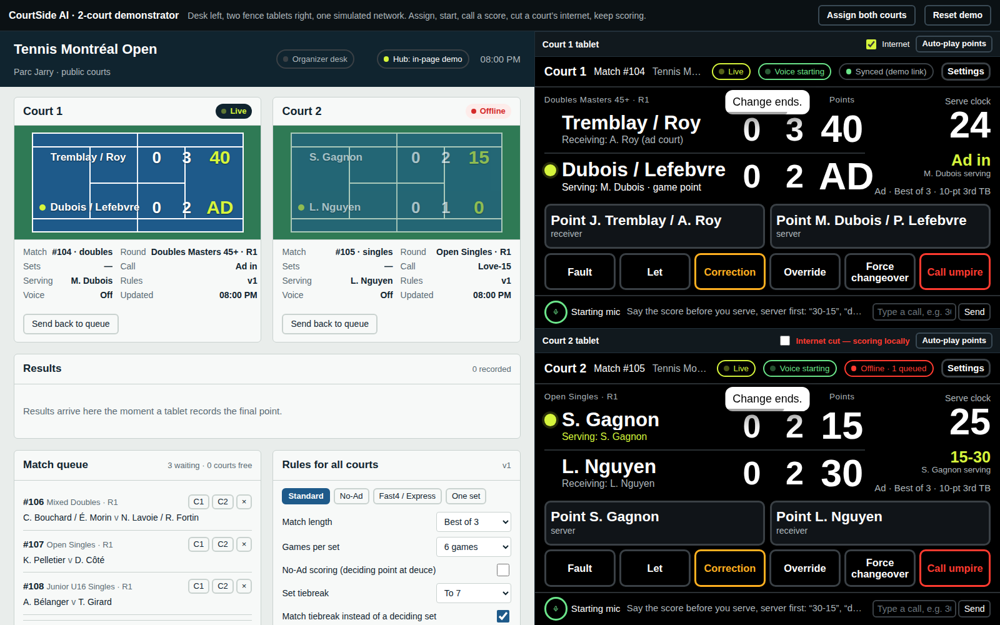
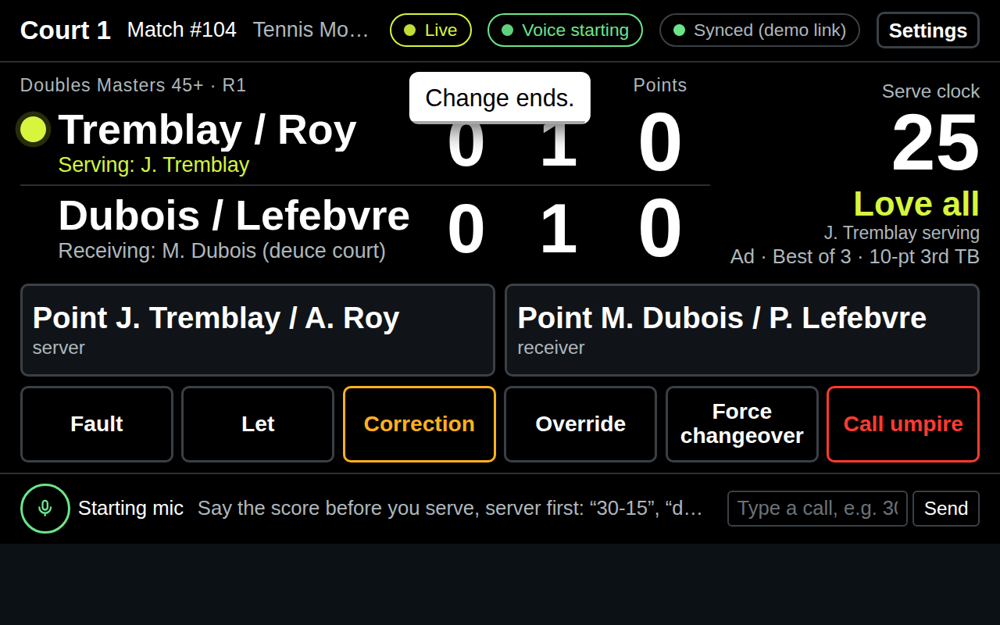
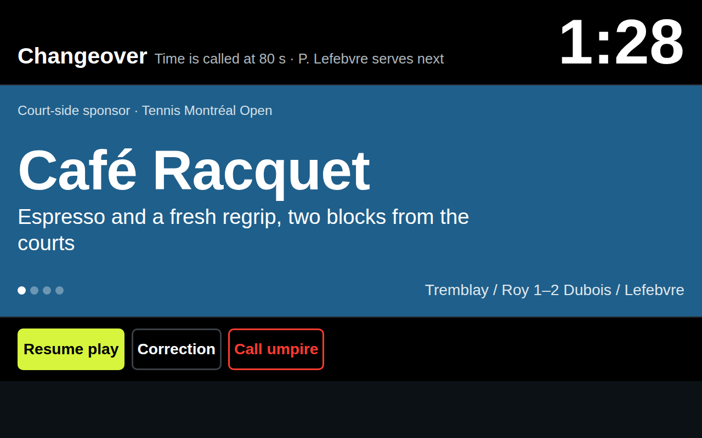
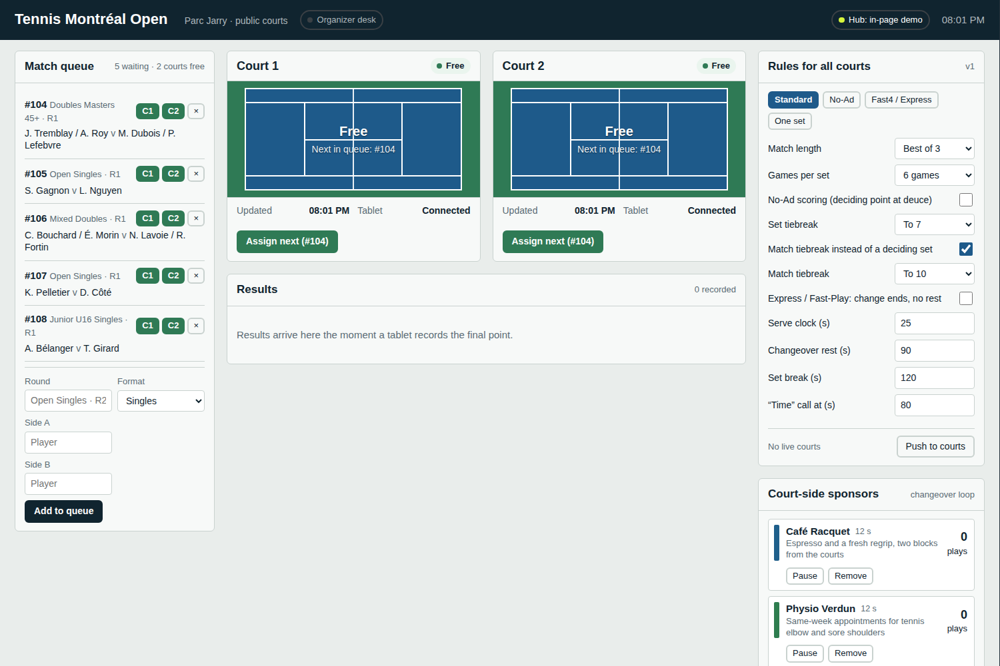

# RallyPoint

Voice-scored court tablets and one organizer desk, synced live over WebSockets. Built as a two-court demonstrator for club and community tennis tournaments: singles, doubles and mixed rotations, No-Ad, Fast4/Express, set and 10-point match tiebreaks, serve clocks, timed changeovers with a spoken "Time" call, court-side sponsor loops, and rules pushed to every court from the desk.



## Run it

```bash
npm install
npm start            # https://localhost:3000 (HTTPS only — voice needs it)
```

The server is HTTPS-only: browsers gate the microphone behind a secure
context, so plain `http://192.168.x.x` tablets get mic errors. A
self-signed cert is generated automatically on first boot (needs openssl;
or run `npm run cert` yourself). Open the printed `https://<lan-ip>:3000`
address on the tablets, accept the one-time "not private" warning, then
voice works. `--key/--cert` (or `SSL_KEY`/`SSL_CERT`) override the certs.

| Page | What it is |
| --- | --- |
| `/` | RallyPoint homepage: a WebGL night court with a rally scored by the real engine, and the door to every screen |
| `/organizer.html` | The desk: queue, court cards, alerts, rules, sponsors, results |
| `/court.html?court=1` | Court 1 tablet (fence-mounted, landscape) |
| `/court.html?court=2` | Court 2 tablet |
| `/demo.html` | Desk and both tablets on one page with an "internet cut" switch per court |
| `/api/state`, `/api/results.csv` | Read-only JSON state and CSV export |

Open the tablet pages on real tablets on the same Wi-Fi using the LAN address printed at start-up. The server keeps tournament state in `data/tournament.json`; `npm run reset` wipes it. `--port 8080` and `--courts 4` are accepted.

**No server?** Open `public/organizer.html` and `public/court.html?court=1` as files in the same browser: the pages fall back to a BroadcastChannel and the organizer tab hosts the hub. `npm run build` produces `dist/rallypoint-standalone.html`, the whole demonstrator in one file that runs from disk.

**Voice** needs Chrome/Edge/Safari with microphone permission over `https://` or `localhost`. Every voice call can also be typed into the tablet's call box, which goes through the identical pipeline, so the demo is fully testable without a microphone.

## What is built

### Court tablet



- **Score wall**: true black background, white numerals sized from the container width so they read from the baseline, optic yellow reserved for the server dot, the live call and the game-point marker. Glare mode inverts to black on white for direct sun.
- **Serve clock** (default 25 s) resets on every point, fault, let and correction, beeps at zero.
- **Voice**: continuous recognition, English or French, with a configurable wake word and a tap-to-arm mode for noisy courts. Calls: `30-15`, `quinze partout`, `deuce`, `ad in`, `ad out`, `game`, `fault`, `let`, `correction`, `umpire`, `changeover`, `time`, `point server`, `point receiver`.
- **Tactile fallback**: two giant point buttons labelled with the players' names and their current role, plus Fault, Let, Correction (undo), Override (manual score editor with server and tiebreak controls), Force changeover and Call umpire.
- **Changeover / set break**: full-screen overlay with the countdown, the next server, a sponsor loop (text, colour, optional logo and a spoken line), the "Time" call at 80 s of a 90 s changeover (tone + speech + yellow flash), auto-resume at zero. A point or fault called during the rest resumes play.
- **Offline resilience**: match state is saved to the tablet on every change; outgoing updates queue in a persistent outbox and replay on reconnect. The tablet shows "Offline · n queued" and keeps scoring.



### Organizer desk



- **Court cards** drawn as court plans: status (Free / Assigned / Live / Changeover / Finished / Offline), sets, games, points, server dot, call, rest countdown, rules version on that court, voice status, last update.
- **Queue**: ordered matches with one-tap assignment to any court, an add-match form for singles or doubles, "Assign next" on freed courts.
- **Alerts**: "Director requested on Court 2", "Court 1 is free", offline replays, results. Umpire calls sound at the desk and stay until acknowledged.
- **Rules for all courts**: presets (Standard, No-Ad, Fast4/Express, One set) and every parameter, pushed with a version number. Live courts adopt the new rules immediately and the desk shows which court is on which version.
- **Sponsors**: manage the changeover loop (name, tagline, colour, spoken line, seconds per play, image), pause or remove, per-sponsor play counts, dollars-per-play estimate, "Push loop to courts".
- **Results** log with CSV export.

## Architecture

```
public/js/scoring.js   pure rules engine + reconciliation of spoken scores     (tested)
public/js/voice.js     en/fr call parser + Web Speech wrapper                   (tested)
public/js/hub.js       tournament reducer: courts, queue, rules, sponsors…     (tested)
public/js/sync.js      transport: WebSocket → BroadcastChannel → in-page, outbox
public/js/audio.js     tones + speech synthesis
public/js/court-app.js      tablet UI (factory: createCourtApp)
public/js/organizer-app.js  desk UI (factory: createOrganizerApp)
server/index.js        static files + `ws` hub, JSON persistence
public/demo.html       both apps and an in-page hub with a simulated network
public/js/landing-rally.js  homepage demo match driven through the engine       (tested)
public/js/landing.js   homepage: three.js night court, rally physics, scoreboard
public/vendor/three.min.js  three.js r158 (UMD), vendored so the page works offline
```

All modules are plain scripts that run unchanged in the browser and in Node (the server requires `hub.js` directly). The hub reducer is the single source of truth for tournament-level state; each tablet is the source of truth for its own match and reports snapshots.

### Protocol

Court → hub: `hello`, `court:state {courtId, seq, snapshot}`, `court:event {kind: umpire | impression | dispute | offlineReplay}`, `bye`.
Desk → hub: `org:assign`, `org:clearCourt`, `org:rules`, `org:sponsors`, `org:ack`, `org:addMatch`, `org:removeMatch`, `org:reorderQueue`, `org:setTournament`, `org:reset`.
Hub → everyone: `snapshot` (on hello) and `tournament` (after every change). Court snapshots carry a monotonic `seq`; the hub ignores stale ones so a replayed backlog cannot roll a court backwards.

## Answers to the "before you build" questions

**Filtering noise and adjacent-court calls.** The tablet does not obey a transcript, it *reconciles* it. A spoken score is an assertion about the state of this match: if it equals the current score it is a confirmation, if it is exactly one point away it is applied, if it matches both "server first" and "receiver first" readings it asks, and anything else, including a call that can only belong to the next court, is rejected and shown as "Not reachable from 30-15" with a one-tap "Set score to X" override for the rare case the tablet is the one that is wrong. On top of that: a confidence floor across the recognizer's alternatives, an optional wake word ("Score, 30-15"), tap-to-arm mode (the mic listens for eight seconds after a tap), and the tablet mutes its own microphone while it speaks so it never hears itself.

**Disputes.** Every accepted call shows a toast with an Undo button; "correction" spoken or tapped reverts the last point (up to 80 steps). Override edits games, points, server and tiebreak state in one screen. "Umpire" raises an alert at the desk with the court number; the desk acknowledges with "On my way" and the tablet shows the director has been called. Every change is written to a per-match log ("Override: 4-3 (30-15)", "Correction", "Rules v3 applied") visible in the tablet's Settings drawer.

**Doubles rotation in tiebreaks.** The engine tracks serve order as a four-player cycle. In a tiebreak the player due to serve serves the first point, then each player serves two points in the cycle; ends change every six points; the set after a tiebreak starts with the player who received the first point of the tiebreak. The score wall names the server and the receiver for every point (deuce or ad court), which is where doubles teams actually lose track.

**Misheard or mispronounced scores.** The parser accepts numbers, words, French, glued digits ("3015"), "five" for fifteen and "juice" for deuce; the recognizer tries up to four alternatives in confidence order and the first one that is *reachable* wins. Whatever is accepted is echoed on the wall and spoken back, with Undo one tap away, so a wrong point never lives longer than the next call.

**Loading sponsors into the changeover loop.** The desk's sponsor panel: add a name, tagline, colour, spoken line and duration, optionally a logo URL, then "Push loop to courts". Tablets cache the loop, cycle through it during changeovers and set breaks, speak the audio line once per play, and report each play to the desk, which totals plays per sponsor and multiplies by a dollars-per-play rate.

**Dashboard and match configuration.** The desk is one screen with no modes: queue on the left, courts in the middle, rules and sponsors on the right, results below. Rules are global and versioned; a court card shows "v2 (desk is v3)" until the tablet confirms the push. Matches are configured in the queue (round, format, names) and everything else is a rule.

**Scoreboard graphics.** Sets / games / points in three columns, the largest type given to points; the server dot and the call in optic yellow; names in family-name form for doubles so they fit; glare mode for direct sun; the changeover overlay carries the score under the sponsor so spectators never lose it.

## Tests

```bash
npm test                     # 43 unit tests: engine, parser, hub, homepage rally, branding
npm i -D jsdom && npm run build && npm test   # + a jsdom end-to-end run of the demonstrator
```

The end-to-end test assigns and starts matches from the desk, feeds voice calls (including an unreachable one that must be rejected), cuts a court's link, scores offline, reconnects and checks the replay, calls the umpire, pushes No-Ad to both live courts, completes a match and checks the result and the changeover sponsor loop.

## Limitations

- Voice recognition uses the browser's Web Speech API, so it needs Chrome, Edge or Safari with network access; a local model would be the next step for noisy outdoor courts.
- Sponsor video is not implemented; the loop supports text, colour, image and a spoken line.
- The hub is a single Node process with a JSON file; for a multi-venue federation it would sit behind a proper database and auth.
- The demonstrator ships with fictional Montréal players and sponsors.
